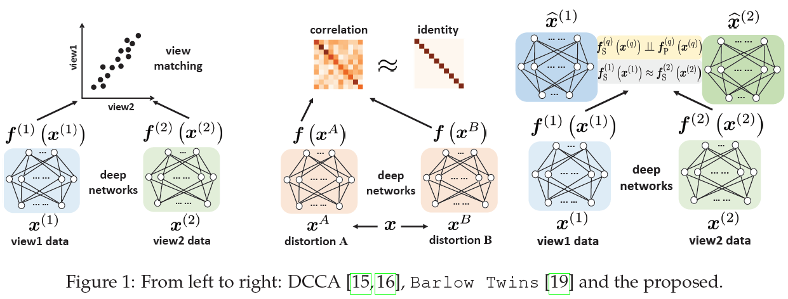

# Multiview Learning and Self-supervision
This is a code demo for the following paper:

[Qi Lyu, Xiao Fu, Weiran Wang and Songtao Lu, '*Understanding Latent Correlation-Based Multiview Learning and Self-Supervision: An Identifiability Perspective*', ICLR 2022, Spotlight.](https://openreview.net/pdf?id=5FUq05QRc5b)

Run the command 'bash run_cars3d.sh' to see sample results on the [Cars3D](https://web.eecs.umich.edu/~honglak/nips2015-analogy.pdf) dataset.

Tested on: python 3.5, PyTorch 1.1.0, cuda 9.0.

The generated samples will be saved in ./synthesized_samples directory.

